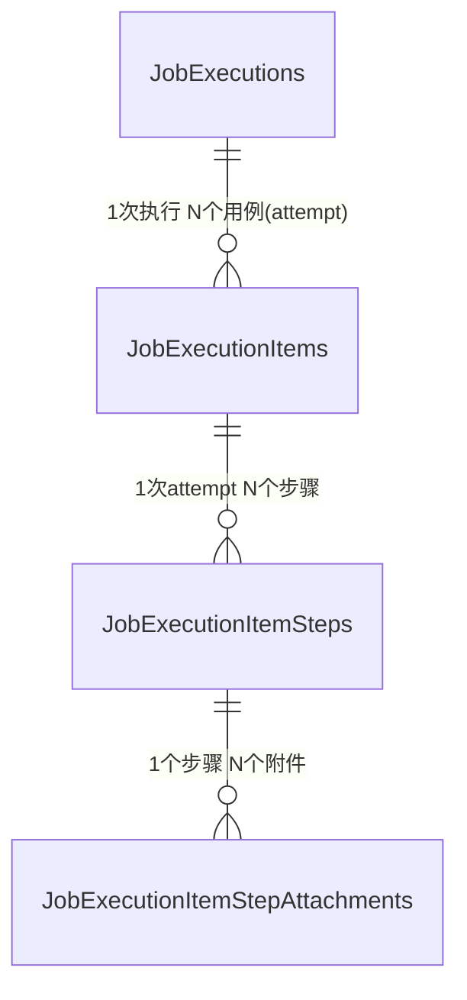

# 自动化用例执行记录 - 接口设计文档

对应数据模型：[automation_tasks.py](../src/app/models/hdp/automation_tasks.py)（`JobExecutions` / `JobExecutionItems` / `JobExecutionItemSteps` / `JobExecutionItemStepAttachments`）

## 1. 数据关系概览



- 同一个 `case_key` 在一次 `execution` 下可能有多行 `JobExecutionItems`（`attempt_number` 递增），对应失败重试；**只增不改、不覆盖**。
- `is_latest=true` 的那一行代表该 case 在本次 execution 下的最终结果，供列表页/统计直接查询，避免聚合 `MAX(attempt_number)`。
- 步骤、附件均为**追加写**，不修改历史数据。

## 2. 接口分类

接口分为两类调用方，鉴权方式不同：

| 分类 | 调用方 | 鉴权建议 |
| --- | --- | --- |
| 上报类接口（Ingestion） | pytest 插件 / CI Runner（机器对机器） | 独立的服务令牌（如 Header `X-Automation-Token`），不复用用户 JWT，需新增 `get_current_automation_client` 依赖 |
| 查询类接口（Query） | 前端管理后台 | 复用现有 `get_current_user` / `get_current_active_admin` |

统一响应信封沿用现有约定：`NormalResponse` / `ErrorResponse`（`code` / `message` / `data` / `success`），分页列表沿用 `xxxListData { total, page, page_size, items }` 结构（参考 [schema.py](../src/app/domains/user/schema.py) 与 [repository.py](../src/app/domains/user/repository.py) 中 `UserListResponse` 的写法）。

统一路由前缀：`/api/v1/automation`。

---

## 3. 上报类接口（pytest 插件 / CI Runner 调用）

### 3.1 创建一次执行（execution 开始）

```
POST /automation/executions
```

pytest session 启动（`pytest_sessionstart`）时调用一次。

请求体：

| 字段 | 类型 | 说明 |
| --- | --- | --- |
| job_id | int | Jenkins 任务 ID |
| job_uid | UUID | 本次 Jenkins build 唯一标识 |
| job_name / job_url | string | 任务名称/地址 |
| start_at | datetime | 开始时间 |
| pre_cases_count | int? | 预计执行用例总数（用于进度展示） |

响应：`{ execution_id }`

### 3.2 结束/更新一次执行

```
PATCH /automation/executions/{execution_id}
```

pytest session 结束（`pytest_sessionfinish`）时调用。

请求体：`status`（completed/failed）、`end_at`、`duration`、`final_success_count`、`final_failure_count`、`final_skipped_count`。

### 3.3 上报一次用例执行开始（新建 attempt）

```
POST /automation/executions/{execution_id}/items
```

每个 case 开始执行时调用一次（`pytest_runtest_protocol` 开始，包括每次重试）。**这是保证"重试不覆盖"的关键接口**。

请求体：

| 字段 | 类型 | 说明 |
| --- | --- | --- |
| case_key | string | pytest nodeid，必填 |
| case_name | string | 用例名称 |
| case_id | int? | 外部用例系统 ID（可选） |
| start_at | datetime | 本次 attempt 开始时间 |

服务端行为（单事务内完成，保证一致性）：
1. 查询 `execution_id + case_key` 下已存在的最大 `attempt_number`（不存在则为 0），`attempt_number = max + 1`。
2. 若已有 `is_latest=true` 的旧行（即这是一次重试），先将其 `is_latest` 置为 `false`。
3. 插入新行：`attempt_number`、`is_latest=true`、`status=running`。
4. 若因唯一约束 `(execution_id, case_key, attempt_number)` 冲突（网络重试导致重复请求），直接查出已存在的行返回，保证接口幂等。

响应：`{ item_id, attempt_number }`

### 3.4 上报一次用例执行结束

```
PATCH /automation/executions/{execution_id}/items/{item_id}
```

`pytest_runtest_logreport` 汇总出最终结果后调用。

请求体：`status`（success/failure/skipped/error）、`end_at`、`duration`、`error_message?`（失败概要，展示用，无需 join steps）。

### 3.5 上报用例步骤

```
POST /automation/executions/{execution_id}/items/{item_id}/steps
```

支持**批量上报**（数组），减少一次 case 多个 setup/call/teardown 步骤产生的请求数：

```json
{
  "steps": [
    { "step_index": 0, "step_name": "setup", "status": "passed", "start_at": "...", "end_at": "..." },
    { "step_index": 1, "step_name": "click login button", "status": "failed", "error_message": "..." }
  ]
}
```

- `step_index` 由调用方传入（pytest 侧本地维护自增序号即可），也可省略由服务端按当前已存在的步骤数自动追加。
- 唯一约束 `(item_id, step_index)`：重复上报同一 `step_index` 走 `ON CONFLICT DO UPDATE`（更新而非报错），保证网络重试幂等；**不同 attempt 之间 `item_id` 不同，天然不会互相覆盖**。

### 3.6 上报步骤附件（截图/日志）

```
POST /automation/steps/{step_id}/attachments
```

支持批量：

```json
{
  "attachments": [
    { "attachment_type": "screenshot", "file_url": "https://.../a.png", "content_type": "image/png", "file_size": 20480 }
  ]
}
```

- 该接口只登记附件的**外部 URL 元数据**，不接收文件二进制内容，避免 API 服务承载大文件流量。
- 推荐配套一个获取对象存储预签名直传地址的接口（如已有存储方案，可复用）：

```
POST /automation/steps/{step_id}/attachments/upload-url
```

pytest 侧先请求预签名 URL → 直传对象存储 → 拿到最终 `file_url` 后再调用 3.6 登记，服务端与文件存储解耦。当前仓库 `infrastructure/storage` 尚为空目录，此步骤需要后续接入具体对象存储 SDK 后落地。

---

## 4. 查询类接口（前端展示）

### 4.1 执行（execution）列表

```
GET /automation/executions?page=&page_size=&job_id=&status=&start_time_from=&start_time_to=
```

返回分页列表，每项含 `final_success_count/failure_count/skipped_count` 等汇总字段，无需 join 明细表即可渲染列表页。

### 4.2 执行详情

```
GET /automation/executions/{execution_id}
```

返回 execution 基本信息 + 统计汇总。

### 4.3 执行下的用例列表（默认只看最终结果）

```
GET /automation/executions/{execution_id}/items?page=&page_size=&status=&case_key=&case_name=
```

默认 `WHERE execution_id=? AND is_latest=true`（命中部分唯一索引），仅返回每个用例的**当前最终结果**；不返回历史重试行，避免列表页数据重复。

### 4.4 单个用例的重试历史

```
GET /automation/executions/{execution_id}/items/by-case/{case_key}/attempts
```

返回该 `case_key` 在本次 execution 下的**全部 attempt**（按 `attempt_number` 升序），用于前端"查看重试记录"展开视图，体现"失败重试不覆盖，全部可追溯"。

### 4.5 单次 attempt 详情（含步骤）

```
GET /automation/items/{item_id}
GET /automation/items/{item_id}/steps
```

后者返回该次 attempt 下所有步骤（按 `step_index` 排序），每个步骤附带附件数量（`attachment_count`），点击失败步骤再拉取附件详情，避免列表接口把所有截图 URL 一次性带出。

### 4.6 步骤附件详情

```
GET /automation/steps/{step_id}/attachments
```

返回该步骤的截图/日志 URL 列表，仅在用户点开失败步骤详情时按需请求。

### 4.7 用例跨执行历史趋势（稳定性分析 / flaky 识别）

```
GET /automation/cases/{case_key}/history?page=&page_size=&execution_id_from=&execution_id_to=
```

基于索引 `idx_job_execution_items_case_key (case_key, start_at)`，按时间倒序返回该 case 在各次 execution 中的最终结果与耗时，用于统计通过率、识别间歇性失败（flaky）用例。

---

## 5. 关键性能与一致性设计要点回顾

1. **重试不覆盖**：每次重试都是 `job_execution_items` 新增一行（`attempt_number` 递增），历史数据永久保留。
2. **快速查最终结果**：`is_latest` 标记 + 部分唯一索引 `(execution_id, case_key) WHERE is_latest`，列表页查询无需聚合。
3. **写入幂等**：上报类接口全部基于唯一约束设计为幂等（`(execution_id, case_key, attempt_number)`、`(item_id, step_index)`），支持 CI 侧网络重试/重复投递而不产生脏数据。
4. **写多读少的数据分层**：步骤表与附件表分离，附件（大字段、易膨胀）独立建表，不拖慢步骤表的高频写入与扫描。
5. **按需加载**：详情类接口分层（execution → items → steps → attachments），前端按需逐层请求，避免一次性拉取全部截图/日志造成大响应体。
